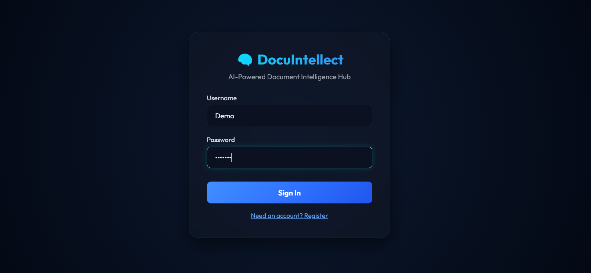
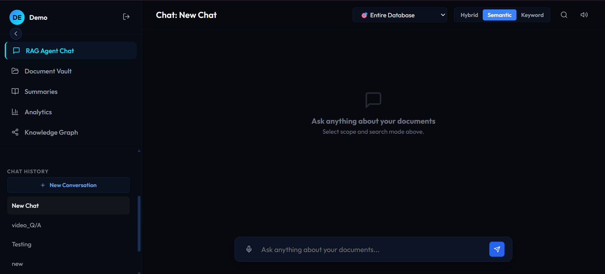
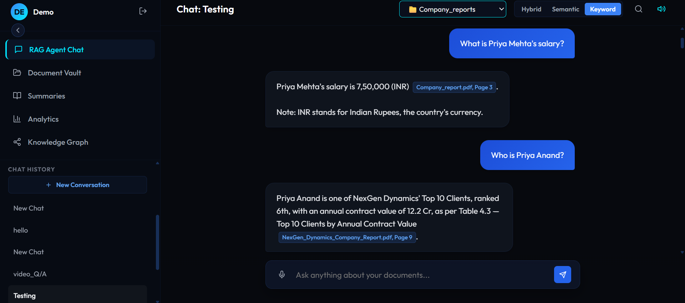
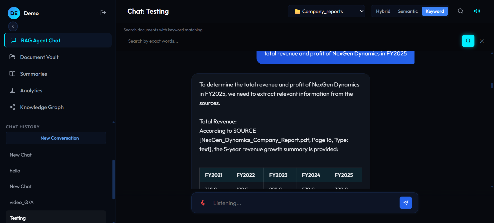
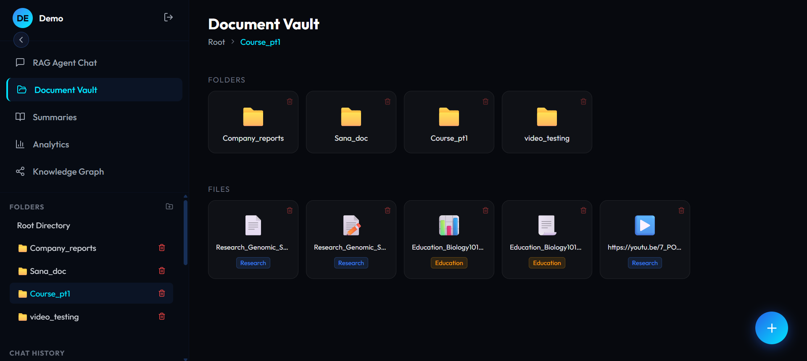
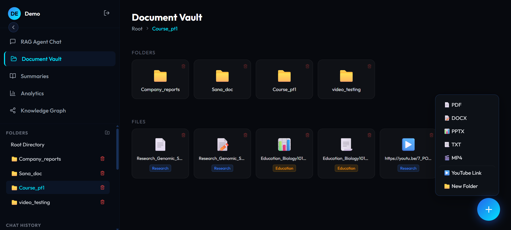
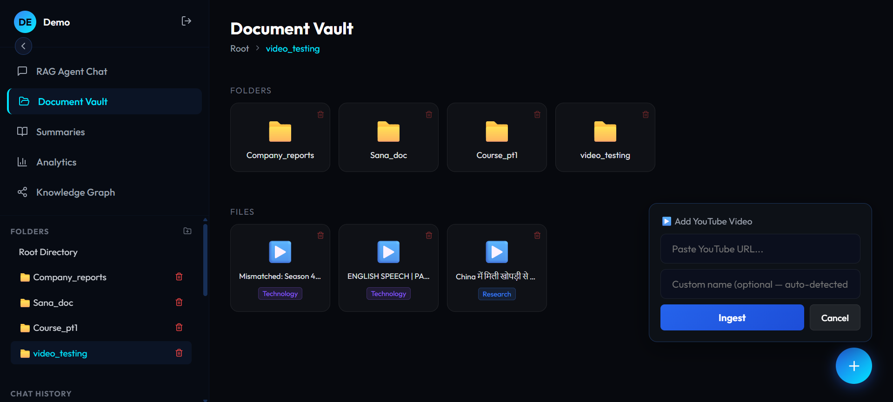
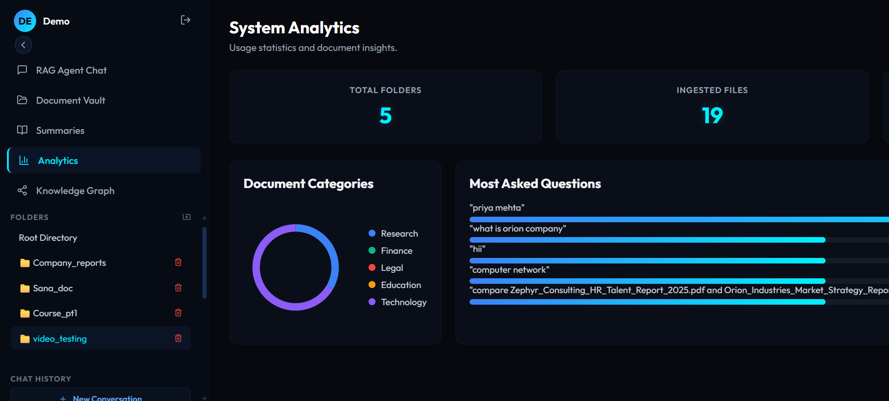
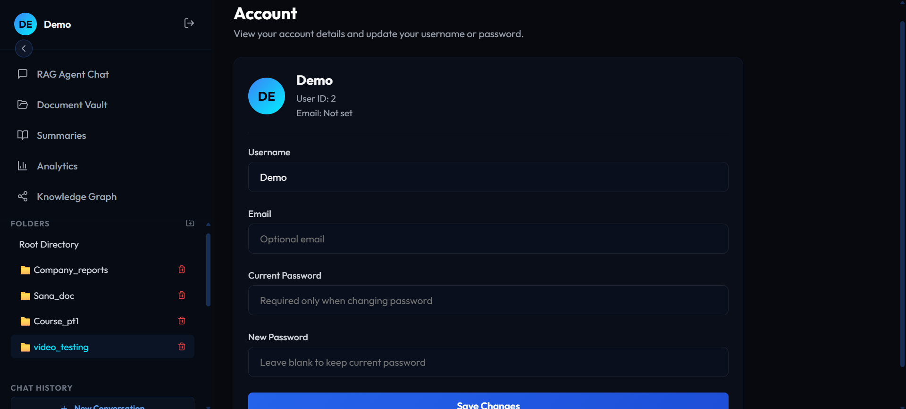

# DocuIntellect

DocuIntellect is a full-stack, multi-user **document intelligence workspace**. Upload PDFs, Word docs, slide decks, text files, videos, and YouTube links into organized folders, then chat with your documents using RAG, search by meaning or keyword, generate summaries, and explore an interactive knowledge graph of extracted entities and relationships — all with page-accurate citations back to the source.

It's built to keep working even when things go wrong: if Elasticsearch is unreachable, it falls back to local retrieval; if no LLM key is set, it falls back to raw-extract answers; if a YouTube video has no captions, it transcribes the audio locally with Whisper.

---

## Features

### Document Vault
- Multi-folder document organization (Google-Drive-style grid view)
- Supported formats: **PDF, DOCX, PPTX, TXT/MD, MP4, YouTube links**
- Drag-free upload via a floating add menu
- In-app document viewer: PDF page-jump, video player, embedded YouTube player
- Auto-categorization (Research / Finance / Legal / Education / Technology) via a built-in ML classifier
- Embedded image extraction from PDFs/PPTX with AI-generated visual descriptions (searchable like text)

### RAG Chat
- Ask questions scoped to the **entire vault**, a **folder**, or a **single document**
- Answers cited with `[filename, Page N]` — click any citation to jump straight to that page in the document viewer
- Follow-up question understanding (resolves "it," "that," "the other one," etc. using recent chat history)
- Comparison-query handling ("compare X and Y") that guarantees both documents are represented in the answer
- Three retrieval modes for searching anything from documents:
  - **Hybrid** — Reciprocal Rank Fusion of semantic + keyword search
  - **Semantic (KNN)** — dense-vector meaning-based search
  - **Keyword (BM25)** — exact-term search
- Voice input (speech-to-text) and voice output (text-to-speech)
- Persistent chat history: create, rename, delete sessions; auto-generated chat titles

### Summaries
- Three summary styles per document: **Short**, **Detailed**, **Key Takeaways**
- One-click Hindi translation of any summary
- Works for documents and video transcripts alike

### Knowledge Graph
- Entity/relationship extraction (LLM-based, with a regex-based local fallback if no LLM key is set)
- Automatic topic clustering (community detection) with color-coded clusters
- Node sizing by connection centrality — the most important entities are visually larger
- Interactive SVG graph: zoom, pan, drag, click any edge to reveal its relationship label
- Cached per document — "Build Graph" reuses the cached result; "Regenerate" forces a fresh extraction
- Stats panel: entity count, relationship count, cluster count, graph density, top connected entities

### Analytics
- KPI overview: total folders, total documents, total queries answered
- Document category distribution (donut chart)
- Most-asked questions (bar chart)

### Account & Auth
- Multi-user registration/login with PBKDF2-SHA256 password hashing (100,000 iterations, salted)
- Account page: view user ID, update username/email, change password

### Resilience by design
- **Elasticsearch offline?** Retrieval automatically falls back to live local re-parsing of your documents — search still works, just without vector embeddings.
- **No Groq API key?** Chat falls back to a "Local Simulation" mode that surfaces the raw matching text extracts instead of an AI-written answer.
- **No video captions?** Falls back to downloading audio and transcribing locally with Whisper — no video is ever left unindexed.

---

## Technology Stack

**Backend:** Python · FastAPI · Uvicorn · SQLite · Elasticsearch 8.x (BM25 + KNN + hybrid RRF) · Groq LLM · NetworkX · scikit-learn · pypdf · python-docx · python-pptx · openai-whisper · youtube-transcript-api · yt-dlp

**Frontend:** React (Vite) · lucide-react · hand-written CSS (no UI framework) · hand-rolled SVG knowledge graph (no charting library)

---

## Project Structure

```
docuintellect/
├── backend/
│   ├── app.py                 FastAPI routes — auth, folders, documents, chat, search, graph, analytics
│   ├── auth.py                PBKDF2 password hashing and verification
│   ├── database.py            SQLite schema, migrations, and all CRUD helpers
│   ├── document_parser.py     PDF/DOCX/PPTX/TXT/MP4/YouTube parsing, chunking, image description
│   ├── es_client.py           Elasticsearch BM25 / KNN / hybrid retrieval, per-document coverage logic
│   ├── rag_engine.py          Groq-backed RAG answer generation, summaries, query rewriting
│   ├── graph_extractor.py     Entity/relationship extraction + NetworkX graph construction
│   ├── ml_classifier.py       TF-IDF + Logistic Regression document category classifier
│   ├── requirements.txt       Python dependencies
│   └── www.youtube.com_cookies.txt   Cookie file used by yt-dlp to reduce YouTube bot-detection failures
├── frontend/
│   ├── src/
│   │   ├── App.jsx            Main React application (all tabs, all UI state)
│   │   ├── App.css            All application styling
│   │   └── main.jsx           React entrypoint
│   ├── package.json           Frontend dependencies and scripts
│   └── vite.config.js
├── storage/                   Uploaded user files (created automatically, per-user subfolders)
├── backend/docu_intellect.db  SQLite database (created automatically on first run)
├── run.py                     Single entrypoint — starts backend + frontend together
├── .env                       Environment configuration
└── README.md
```

---

## Requirements

- **Python 3.9+**
- **Node.js 18+** and **npm**
- **Elasticsearch 8.x** with the `.multilingual-e5-small_linux-x86_64` inference model configured *(optional — the app works without it, with reduced search quality)*
- **ffmpeg** on your system PATH *(required for Whisper audio/video transcription)*
- **Groq API key** *(optional — the app works without it, in Local Simulation mode)*

---

> If `ES_URL` is unreachable at runtime, the app detects this automatically and falls back to local retrieval — no configuration change needed when switching networks (e.g. office vs. home).

---

## Install

```bash
# Backend
pip install -r backend/requirements.txt

# Frontend
cd frontend
npm install
cd ..
```
---

## ▶ Run

From the project root:

```bash
python run.py
```

This starts both the FastAPI backend (`http://0.0.0.0:8000`) and the Vite frontend (`http://0.0.0.0:5173`) together, bound to all network interfaces so the app is reachable from other devices on your LAN.

Open in your browser:

```text
http://localhost:5173
```

Register a new account, log in, and start uploading documents.

> **Microphone/voice input** requires a secure context. Use `http://localhost:5173` on the same machine, or serve the app over HTTPS — browsers block mic access on plain-HTTP LAN addresses.

To stop both servers, press `Ctrl+C` in the terminal running `run.py`.

---

## Notes & Known Behaviors

- If Elasticsearch is offline, uploads still succeed and files are stored — retrieval quality is reduced (local heuristic matching only) until Elasticsearch becomes available and documents are re-indexed.
- If Whisper or ffmpeg isn't installed, MP4 uploads fall back to a metadata placeholder and the UI explains transcription wasn't available.
- The Retrieval Preview panel (search icon in the chat header) is for inspection only — the active chat answer always uses whichever mode is selected in the chat header at send time.
- Knowledge graphs are cached per document; click **Regenerate** to force a fresh extraction (results can vary slightly between regenerations since extraction uses an LLM).
- Summaries are generated automatically on upload and cached in the database; they're only regenerated if missing.

---

# 🎥 Demo

<p align="center">
  
</p>

---

# 📸 Screenshots

## 🔐 Login Page

<p align="center">
  
</p>

---

## 🆕 New Chat

<p align="center">
  
</p>

---

## 💬 RAG Chat Interface

<p align="center">
  
</p>

---

## 🔍 Smart Search

<p align="center">
  
</p>

---

## 📂 Document Vault

<p align="center">
  
</p>

---

## 📄 Supported Document Types

<p align="center">
  
</p>

---

## 🎥 YouTube Analysis

<p align="center">
  
</p>

---

## 📊 Analytics Dashboard

<p align="center">
  
</p>

---

## 👤 Account Information

<p align="center">
  
</p>

---

## 📈 Knowledge Graph Visualization

<p align="center">
  
</p>

---

## 📝 AI Summary Generation

<p align="center">
  
</p>